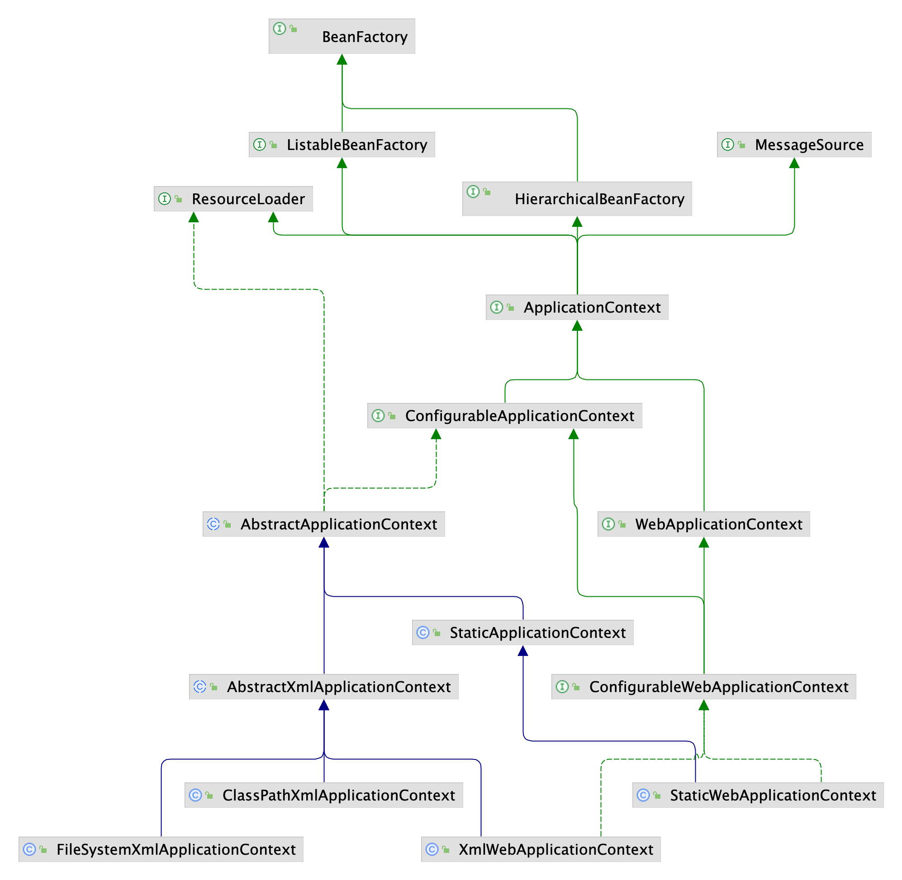

以下是 Spring 1.0 源码分析。

## 核心组件

### Bean 组件

Bean 组件定义在 Spring 的 **org.springframework.beans** 包下，解决了以下几个问题：

这个包下的所有类主要解决了三件事：

- Bean 的定义
- Bean 的创建
- Bean 的解析

Spring Bean 的创建是典型的工厂模式，它的顶级接口是 BeanFactory。

#### BeanFactory

BeanFactory：Bean 的工厂类

```java
public interface BeanFactory {
	Object getBean(String name) throws BeansException;

	Object getBean(String name, Class requiredType) throws BeansException;

	boolean containsBean(String name);

	boolean isSingleton(String name) throws NoSuchBeanDefinitionException;

	String[] getAliases(String name) throws NoSuchBeanDefinitionException;
}
```

BeanFactory 提供方法：

- 通过名称获取 bean 实例，可以是独立实例或者单例实例

- 通过名称和指定类型获取 bean 实例，可以是独立实例或者单例实例
- 判断是否包含指定名称的实例
- 判断指定名称的实例是否是单例
- 获取指定名称的实例的别名


BeansException 继承自 NestedRuntimeException，NestedRuntimeException 提供了对 cause 的封装，JDK1.4的 RuntimeException 实现了这个。

BeansException的子类：

- FatalBeanException
  - ApplicationContextException
  - BeanCreationException
  - BeanDefinitionStoreException
    - FactoryBeanCircularReferenceException
    - UnsatisfiedDependencyException
  - BeanDefinitionValidationException
  - BeanInitializationException
  - BootstrapException
  - NullValueInNestedPathException

- BeanNotOfRequiredTypeException
  - BeanIsNotAFactoryException
- PropertyAccessException
  - MethodInvocationException
  - TypeMismatchException
- NoSuchBeanDefinitionException
- NotWritablePropertyException
- PropertyAccessExceptionsException

BeanFactory 有三个子类：ListableBeanFactory、HierarchicalBeanFactory 和 AutowireCapableBeanFactory。目的是为了**区分 Spring 内部对象处理和转化的数据限制**。


BeanFactory：接口

- HierarchicalBeanFactory：接口，可以继承的 BeanFactory
  - ConfigurableBeanFactory：接口，可以配置的 BeanFactory
    - ConfigurableListableBeanFactory：接口，SPI 接口，可配置和枚举的 BeanFactory
      - DefaultListableBeanFactory：类
        - XmlBeanFactory：类
    - AbstractBeanFactory：抽象类
      - AbstractAutowireCapableBeanFactory：抽象类
- AutowireCapableBeanFactory：接口，可以自动装配的 BeanFactory
- ListableBeanFactory：接口，可以枚举实例的 BeanFactory


但是从图中可以发现最终的默认实现类是 DefaultListableBeanFactory，它实现了所有的接口。


#### HierarchicalBeanFactory

层次化的 BeanFactory，意思就是可以获取到某个 BeanFactory 的父 BeanFactory，需要注意的是此接口只是获取父 BeanFactory 并没有设置父容器的方法。

```java
public interface HierarchicalBeanFactory extends BeanFactory {
	BeanFactory getParentBeanFactory();
}
```

#### ConfigurableBeanFactory

此接口表明可以对容器进行配置，主要体现在以下几个方面

- 设置父容器
- 注册定制的类型转换器
- 注册BPP
- 注册别名
- 配置可以忽略的类型

```java
public interface ConfigurableBeanFactory extends HierarchicalBeanFactory {

	void setParentBeanFactory(BeanFactory parentBeanFactory);

	void registerCustomEditor(Class requiredType, PropertyEditor propertyEditor);

	void ignoreDependencyType(Class type);

	void addBeanPostProcessor(BeanPostProcessor beanPostProcessor);

	BeanDefinition getBeanDefinition(String beanName) throws BeansException;

	void registerAlias(String beanName, String alias) throws BeansException;

	void registerSingleton(String beanName, Object singletonObject) throws BeansException;

	void destroySingletons();
}
```

#### AutowireCapableBeanFactory

此接口是表明容器有装配能力，也就是 ioc 能力。

```java
public interface AutowireCapableBeanFactory extends BeanFactory {
	Object autowire(Class beanClass, int autowireMode, boolean dependencyCheck)
			throws BeansException;

	void autowireBeanProperties(Object existingBean, int autowireMode, boolean dependencyCheck)
			throws BeansException;

	Object applyBeanPostProcessorsBeforeInitialization(Object existingBean, String name)
			throws BeansException;

	Object applyBeanPostProcessorsAfterInitialization(Object existingBean, String name)
			throws BeansException;

}
```

支持的装配方式有：

- AUTOWIRE_BY_NAME：根据名称装配
- AUTOWIRE_BY_TYPE：根据类型装配
- AUTOWIRE_CONSTRUCTOR：根据构造方法装配
- AUTOWIRE_AUTODETECT：自动检测

该接口的方法：

- autowire：在实例化对象时进行装配
- autowireBeanProperties：对一个对象的属性进行装配
- applyBeanPostProcessorsBeforeInitialization：在实例化方法之前应用 BeanPostProcessors
- applyBeanPostProcessorsAfterInitialization：在实例化方法之后应用 BeanPostProcessors

#### ConfigurableListableBeanFactory

这个接口是一个功能非常全的接口，实现此接口基本就是一个功能完整的容器了，此接口的代码如下：

```java
public interface ConfigurableListableBeanFactory
		extends ListableBeanFactory, ConfigurableBeanFactory, AutowireCapableBeanFactory {
	void preInstantiateSingletons();
}
```

- preInstantiateSingletons：预先初始化所有的非延迟初始化单例bean，这也是很多容器的默认功能。

#### DefaultListableBeanFactory

这个类就是一个具有完整功能的spring容器，类的声明如下：

```java
public class DefaultListableBeanFactory extends AbstractAutowireCapableBeanFactory
    implements ConfigurableListableBeanFactory, BeanDefinitionRegistry {}
```

在spring 1.0中核心的工厂类就 DefaultListableBeanFactory这一个，其类层次如下：


##### BeanDefinitionRegistry

DefaultListableBeanFactory类也实现了BeanDefinitionRegistry接口，此接口是用来保存BeanDefinition信息的，此接口相当于是BeanDefinition的一个注册表，可以添加BeanDefinition也可以查询是否包含BeanDefinition等信息，其结构如下：

```java
public interface BeanDefinitionRegistry {
	int getBeanDefinitionCount();

	String[] getBeanDefinitionNames();

	boolean containsBeanDefinition(String name);

	BeanDefinition getBeanDefinition(String name) throws BeansException;

	void registerBeanDefinition(String name, BeanDefinition beanDefinition)
			throws BeansException;

	String[] getAliases(String name) throws NoSuchBeanDefinitionException;

	void registerAlias(String name, String alias) throws BeansException;

}
```

- getBeanDefinitionCount：获取 BeanDefinition 数量
- getBeanDefinitionNames：获取 BeanDefinition 名称
- containsBeanDefinition：是否包含某个名称的 BeanDefinition
- getBeanDefinition：根据名称获取 BeanDefinition
- getAliases：获取别名
- registerAlias：注册别名

##### BeanDefinition

BeanDefinition 描述了一个Bean的配置信息，它包含属性值、构造函数配置等等信息，其结构如下：

```java
public interface BeanDefinition {
	MutablePropertyValues getPropertyValues();

	ConstructorArgumentValues getConstructorArgumentValues();

	String getResourceDescription();
}
```

我们自己定义的各个 Bean 其实会转换成一个个 BeanDefinition 存在于 Spring 的 BeanFactory 中

```java
public class DefaultListableBeanFactory extends AbstractAutowireCapableBeanFactory
        implements ConfigurableListableBeanFactory, BeanDefinitionRegistry, Serializable {
		private Map beanDefinitionMap = new HashMap();
}   
```

BeanDefinition：

- AbstractBeanDefinition
  - RootBeanDefinition
  - ChildBeanDefinition

###### AbstractBeanDefinition

AbstractBeanDefinition 抽象 BeanDefinition，定义了下面四个属性：

```java
private MutablePropertyValues propertyValues;

private String resourceDescription;

private boolean singleton = true;

private boolean lazyInit = false;
```

提供了一个 validate 方法：用来校验lazy-init属性设置为true时，此bean是否是个单例bean。

```java
public void validate() throws BeanDefinitionValidationException {
  if (this.lazyInit && !this.singleton) {
    throw new BeanDefinitionValidationException("Lazy initialization is just applicable to singleton beans");
  }
}
```


###### ChildBeanDefinition

在spring 1.0版本的ChildBeanDefinition中，此BeanDefinition表示没有定义class属性数据，但定义了parent属性的BeanDefinition，子BeanDefinition会继承父BeanDefinition的属性配置，也就是PropertyValues类型的数据，但不会构造函数相关的配置。

```java
private String parentName;
```

###### RootBeanDefinition

增加了下面几个属性：

```java
private Object beanClass;

private ConstructorArgumentValues constructorArgumentValues;

private String[] dependsOn;

private String initMethodName;

private String destroyMethodName;
```


##### XmlBeanFactory

DefaultListableBeanFactory 的使用是需要自己手动的创建 BeanDefinition，然后调用 registerBeanDefinition方法注册到容器中，之后就可以利用 getBean 方法来获取 bean 对象，而 XmlBeanFactory 类是靠解析 xml 文件中的内容来注册 bean 信息的。其代码声明如下：

```java
public class XmlBeanFactory extends DefaultListableBeanFactory {}
```

XmlBeanFactory 通过 XmlBeanDefinitionReader 类解析 xml 文件创建 BeanFactory。

#### FactoryBean

FactoryBean：工厂 Bean，由 BeanFactory 中使用的对象实现的接口，这些对象本身就是工厂。如果一个bean实现了这个接口，它就被用作一个工厂，而不是直接作为一个bean。FactoryBean 可以支持单例和原型。

注意：实现此接口的 bean 不能用作普通 bean。

```java
public interface FactoryBean {
	Object getObject() throws Exception;

	Class getObjectType();

	boolean isSingleton();
}
```


FactoryBean实现类：

- PropertiesFactoryBean
- ResourceFactoryBean
- SetFactoryBean
- MapFactoryBean
- ListFactoryBean
- MethodInvokingFactoryBean

#### XxxPostProcessor

后置处理器是一种拓展机制，贯穿Spring Bean的生命周期

后置处理器分为两类：

- **BeanFactory后置处理器：BeanFactoryPostProcessor**，实现该接口，可以在**spring的bean创建之前**，修改bean的定义属性。

```java
public interface BeanFactoryPostProcessor {
    /*
     *  该接口只有一个方法postProcessBeanFactory，方法参数是ConfigurableListableBeanFactory，通过该参数，可以获取BeanDefinition
    */
    void postProcessBeanFactory(ConfigurableListableBeanFactory beanFactory) throws BeansException;
}
```

- **Bean后置处理器：BeanPostProcessor**，实现该接口，可以在spring容器实例化bean之后，在**执行bean的初始化方法前后**，添加一些处理逻辑。

```java
public interface BeanPostProcessor {
    //bean初始化方法调用前被调用
    Object postProcessBeforeInitialization(Object bean, String beanName) throws BeansException;
    //bean初始化方法调用后被调用
    Object postProcessAfterInitialization(Object bean, String beanName) throws BeansException;
}
```

**运行顺序**：

- Spring IOC容器实例化Bean
- 调用BeanPostProcessor的postProcessBeforeInitialization方法
- 调用bean实例的初始化方法
- 调用BeanPostProcessor的postProcessAfterInitialization方法

### Context 组件

Context 在 Spring 的 org.springframework.context 包下

Context 模块构建于 Core 和 Beans 模块基础之上，提供了一种类似于 JNDI 注册器的框架式的对象访问方法。Context 模块继承了 Beans 的特性，为 Spring 核心提供了大量扩展，添加了对国际化（例如资源绑定）、事件传播、资源加载和对 Context 的透明创建的支持。

ApplicationContext 是 Context 的顶级接口：



## BeanDefinition 管理

在 xml 中像下面那样配置一个 bean 时等价于创建了一个 BeanDefinition 对象。

```xml
<bean id="testBean" name="testBean,test" class="org.springframework.context.TestBean" 
      lazy-init="false"
      singleton="true"
      init-method="init" destroy-method="destroy" autowire="autodetect">
    <property name="name">
        <value>test</value>
    </property>
</bean>
```

spring 的最最本质的内容其实就是解析配置文件然后返回一个已经装配完毕的完全可用的对象。

而从技术上来说就是以下几个功能的处理

- 创建BeanDefinition
- 注册管理BeanDefinition
- 依据BeanDefinition创建装配好的对象

为了学习的简单性，我们这里排除装配，只是简单的通过 spring 获取下面类的一个受 spring 管理的对象来了解spring最核心能力

```java
package org.springframework.config;

public class EmptyBean {

}
```

### 创建BeanDefinition

在Spring中通过接口`BeanDefinition`代表BeanDefinition，其有一个实现类就是`RootBeanDefinition` ，我们可以利用它来创建一个BeanDefinition。

```java
RootBeanDefinition rbd = new RootBeanDefinition(EmptyBean.class, 0);
rbd.setSingleton(false);
```

### 注册BeanDefinition

在Spring中用BeanDefinitionRegistry接口来代表着BeanDefinition的注册表，它会记录管理所有的BeanDefinition。

此接口在spring 1.0中只有2个类实现了它：DefaultListableBeanFactory和XMLBeanFactory，其中XmlBeanFactory是DefaultListableBeanFactory的子类型。

下面的代码创建了一个BeanDefinitionRegistry并注册了一个BeanDefinition

```java
BeanDefinitionRegistry registry = new DefaultListableBeanFactory();
registry.registerBeanDefinition("EmptyBean", rbd);
```

> 在DefaultListableBeanFactory类中有实现BeanDefinitionRegistry接口的registerBeanDefinition方法，其实现逻辑如下：
>
> - 如果是AbstractBeanDefinition就调用validate方法校验，不通过直接抛异常结束注册
> - 从内部的Map中依据名字取出已经注册的同名的BeanDefinition
> - 如果内部存放BeanDefinition的map没有，就往存放BeanDefinition名字的list集合添加名字并把当前的名字与BeanDefinition保存到内部map中
> - 如果能找到同名的BeanDefinition，那么如果容器不支持覆盖就抛异常结束注册，如果支持覆盖就输出日志继续注册过程
>
> 代码如下：
>
> ```java
> public void registerBeanDefinition(String name, BeanDefinition beanDefinition)
> 		throws BeanDefinitionStoreException {
> 		if (beanDefinition instanceof AbstractBeanDefinition) {
> 			try {
> 				((AbstractBeanDefinition) beanDefinition).validate();
> 			} catch (BeanDefinitionValidationException ex) {
> 				throw new BeanDefinitionStoreException(beanDefinition.getResourceDescription(), name,
> 					"Validation of bean definition with name failed", ex);
> 			}
> 		}
> 		Object oldBeanDefinition = this.beanDefinitionMap.get(name);
> 		if (oldBeanDefinition != null) {
> 			if (!this.allowBeanDefinitionOverriding) {
> 				throw new BeanDefinitionStoreException("Cannot register bean definition [" + beanDefinition + "] for bean '" +
> 													   name + "': there's already [" + oldBeanDefinition + "] bound");
> 			} else {
> 				logger.info("Overriding bean definition for bean '" + name +
> 							"': replacing [" + oldBeanDefinition + "] with [" + beanDefinition + "]");
> 			}
> 		} else {
> 			this.beanDefinitionNames.add(name);
> 		}
> 		this.beanDefinitionMap.put(name, beanDefinition);
> 	}
> ```

而registerBeanDefinition方法就是用一个Map记录下所有的BeanDefinition，其键是bean的名字也就是方法的第一个参数 ，其值就是方法的第二个参数，并且也用一个List记录下了所有的bean的名字。

```java
for (String beanDefinitionName : registry.getBeanDefinitionNames()) {
  System.out.println(beanDefinitionName);
}
```


### 获取实例

获取实例的getBean方法来自于BeanFactory接口，而凑巧的是DefaultListableBeanFactory类也间接实现了此接口，所以可以利用下面的代码来获取实例

```java
Object bean = ((DefaultListableBeanFactory) registry).getBean("EmptyBean");
```

理解spring源码就从上面这个开始入手，特别是getBean方法的实现，而且此时你重点关注原型对象是如何处理的，之后再去看单例怎么处理，ioc怎么处理，最后才是aop，事务等方面的功能代码的阅读。至于xml的解析并没有顺序性建议。

### ChildBeanDefinition

在spring 1.0版本的ChildBeanDefinition中，此BeanDefinition表示没有定义class属性数据，但定义了parent属性的BeanDefinition，子BeanDefinition会继承父BeanDefinition的属性配置，也就是PropertyValues类型的数据，但不会构造函数相关的配置。下面是它的用法

```java
RootBeanDefinition rbd = new RootBeanDefinition(ParentBean.class, 0);
ChildBeanDefinition cbd = new ChildBeanDefinition("p", null);
BeanDefinitionRegistry registry = new DefaultListableBeanFactory();
registry.registerBeanDefinition("p", rbd);
registry.registerBeanDefinition("c", cbd);

Object bean = ((DefaultListableBeanFactory) registry).getBean("c");
System.out.println(bean);
```

需要注意的是ChildBeanDefinition是没有办法设置class信息的，***这个设计并不好*** ，后续的spring版本已经对其进行了改进，在此版本中主要针对的场景是一个类有许多的属性值设置，大部分相同，少部分不同，这个时候用父子bean配置可以精简配置，比如下面情况

```xml
<bean id="p" class="org.springframework.beans.ParentBean">
    <property name="name">
        <value>aa</value>
    </property>
</bean>

<bean id="c1" parent="p">
    <property name="id">
        <value>1</value>
    </property>
</bean>
<bean id="c2" parent="p">
    <property name="id">
        <value>2</value>
    </property>
</bean>
```

### PropertyValues

一个个的属性数据是靠类型PropertyValue来保存的，许多个这样的对象就构成了PropertyValues，BeanDefinition就是靠PropertyValues来记录属性配置信息的

#### PropertyValue

此类的代码非常简单，主要用来记录键值对形式的数据，利用这个类型是为了增加灵活性，因为这个类型的数据可以来自于Map，properties文件，环境变量等等。

```java
public class PropertyValue {
  private String name;
  private Object value;
}
```

#### PropertyValues

此接口相当于是PropertyValue的一个集合，实现类包含许多的PropertyValue对象，也就是说包含很多的属性键值对

```java
public interface PropertyValues {
  PropertyValue[] getPropertyValues();	
  PropertyValue getPropertyValue(String propertyName);
  boolean contains(String propertyName);
  PropertyValues changesSince(PropertyValues old);
}
```

#### MutablePropertyValues

可变的 PropertyValues。

其基本使用方法如下：

```java
PropertyValue p1 = new PropertyValue("id", 100);
PropertyValue p2 = new PropertyValue("name", "cj");

MutablePropertyValues pvs = new MutablePropertyValues();
pvs.addPropertyValue(p1);
pvs.addPropertyValue(p2);

PropertyValue p3 = new PropertyValue("id", 20);
pvs.setPropertyValueAt(p3, 0);

System.out.println(pvs.getPropertyValue("id"));
System.out.println(pvs.getPropertyValue("name"));
```

输出的结果如下，其中setPropertyValueAt方法充分体现了这个类为什么叫可变的PropertyValues，当然了，在MutablePropertyValues的其它方法也体现了其可变性，比如addPropertyValue

```java
PropertyValue: name='id'; value=[20]
PropertyValue: name='name'; value=[cj]
```

MutablePropertyValues代码比较简单，只是简单介绍一下changesSince方法的含义，其作用是比较当前MutablePropertyValues对象与传递给changesSince方法的参数对象之间的不同点，所有这些不同点构成一个MutablePropertyValues对象并返回。

```java
PropertyValue p1 = new PropertyValue("id", 100);
PropertyValue p2 = new PropertyValue("name", "cj");

MutablePropertyValues pvs = new MutablePropertyValues();
pvs.addPropertyValue(p1);
pvs.addPropertyValue(p2);

MutablePropertyValues old = new MutablePropertyValues(pvs);

PropertyValue p3 = new PropertyValue("id", 20);
pvs.setPropertyValueAt(p3, 0);

System.out.println(pvs.changesSince(old));
```

输出：`MutablePropertyValues: length=1; PropertyValue: name='id'; value=[20]`

###  BeanWrapper

BeanWrapper接口以及其唯一的实现类BeanWrapperImpl主要的目标是方便给bean对象设置属性，内部主要是靠内省（Introspection）机制来实现这一功能，主要特定有

- 支持自动类型转换处理，通过PropertyEditor实现
- 支持嵌套属性值设置，比如address.province这样的属性，其中address是某个bean的属性名，而province是Address类的属性名
- 给属性设置和获取属性值
- 检查属性是只读属性还是可写属性

其基本用法如下：

```java
BeanWrapperImpl beanWrapper = new BeanWrapperImpl(ParentBean.class);
Object instance = beanWrapper.doTypeConversionIfNecessary("11", Integer.class);
System.out.println(instance);
```

除了实例化时传递某一个类以外，BeanWrapperImpl还支持传递一个对象，比如下面的代码,这样做的主要目标是为了方便设置bean的属性值

```java
BeanWrapper beanWrapper = new BeanWrapperImpl(new ParentBean());
Object instance = beanWrapper.getWrappedInstance();
System.out.println(instance);
```

上面的写法是直接利用BeanUtils的instantiateClass方法来实例化ParentBean类这个对象，并且采用的是ParentBean的默认构造函数实例化对象的。

如果想给bean的属性赋值，需要编写类似下面的代码来完成

```java
BeanWrapperImpl beanWrapper = new BeanWrapperImpl(ParentBean.class);
PropertyValue p1 = new PropertyValue("id", 111);
PropertyValue p2 = new PropertyValue("name", "test");

MutablePropertyValues pvs = new MutablePropertyValues();
pvs.addPropertyValue(p1);
pvs.addPropertyValue(p2);

beanWrapper.setPropertyValues(pvs);
Object instance = beanWrapper.getWrappedInstance();
System.out.println(instance);
```

输出结果为：

```java
PropertyValue: name='id'; value=[111]
PropertyValue: name='name'; value=[test]
ParentBean{id=111, name='test'}
```

#### PropertyEditor

BeanWrapperImpl主要利用PropertyEditor在给属性赋值时进行类型转换，比如下面的代码就把字符串转换成了一个Class对象

```java
BeanWrapperImpl beanWrapper = new BeanWrapperImpl();
Object instance = beanWrapper.doTypeConversionIfNecessary(
  "org.springframework.beans.ParentBean", ParentBean.class.getClass());
System.out.println(instance);
System.out.println(instance.getClass().getName());
```

这里能成功是因为BeanWrapperImpl在其静态代码块注册几个spring提供的默认PropertyEditor

```java
static {
  defaultEditors.put(Class.class, ClassEditor.class);
  defaultEditors.put(File.class, FileEditor.class);
  defaultEditors.put(Locale.class, LocaleEditor.class);
  defaultEditors.put(Properties.class, PropertiesEditor.class);
  defaultEditors.put(String[].class, StringArrayPropertyEditor.class);
  defaultEditors.put(URL.class, URLEditor.class);
}
```

下面是ClassEditor的代码

```java
public class ClassEditor extends PropertyEditorSupport {
	public void setAsText(String text) throws IllegalArgumentException {
		Class clazz = null;
		try {
			clazz = Class.forName(text, true, Thread.currentThread().getContextClassLoader());
		} catch (ClassNotFoundException ex) {
			throw new IllegalArgumentException("Invalid class name [" + text + "]: " + ex.getMessage());
		}
		setValue(clazz);
	}

	public String getAsText() {
		return ((Class) getValue()).getName();
	}
}
```

除了这些默认的转换器外，还可以添加自定义的转换器，BeanWrapperImpl总是先用自定义的转换器再考虑使用默认的转换器

```java
public void registerCustomEditor(Class requiredType, PropertyEditor propertyEditor) {
  registerCustomEditor(requiredType, null, propertyEditor);
}
```

由于默认情况下spring都是把字符串转换成某些类型，这样有了这些转换器之后就可以给配置提供更多的方便，比如下面的配置就是直接给Class类型的属性赋值了一个字符串

```xml
<bean id="myEntity" class="org.springframework.beans.MyEntity">
    <property name="clz">
        <value>org.springframework.beans.ParentBean</value>
    </property>
</bean>
```

上面的配置等价于执行下面的代码

```java
BeanWrapperImpl beanWrapper = new BeanWrapperImpl(MyEntity.class);
PropertyValue p1 = new PropertyValue("clz", "org.springframework.beans.ParentBean");

MutablePropertyValues pvs = new MutablePropertyValues();
pvs.addPropertyValue(p1);

beanWrapper.setPropertyValues(pvs);
Object instance = beanWrapper.getWrappedInstance();
System.out.println(instance); //MyEntity{clz=class org.springframework.beans.ParentBean}
```

### ConstructorArgumentValues

此类是用来记录构造函数设置的，它分为两类设置，代码如下：

```java
public class ConstructorArgumentValues {
  private Map indexedArgumentValues = new HashMap();
  private Set genericArgumentValues = new HashSet();
}
```

一类是有索引位置信息的，针对的下面这样的xml配置,这种索引构造配置可以有type设置也可以没有type设置，此类都支持

```xml
<constructor-arg index="0" type="int">
  <value>100</value>
</constructor-arg>
<constructor-arg index="1">
  <value>cj</value>
</constructor-arg>
```

而另一类配置是只记录构造函数值，可选的记录下构造函数的值的类型，针对的下面这样的配置

```xml
<constructor-arg >
  <value>cj</value>
</constructor-arg>

<constructor-arg type="java.lang.String">
  <value>cj</value>
</constructor-arg>
```

#### ValueHolder

而为了管理方便，所有的值都由ValueHolder类型进行封装，其中type属性是可以为null的

```java
public static class ValueHolder {
  private Object value;
  private String type;
}
```

#### 基本用法

ConstructorArgumentValues 类的 getArgumentValue(int,Class) 方法用于获取构造参数的值，这一点可以在AbstractAutowireCapableBeanFactory类的autowireConstructor中看到。

当前spring版本获取不了构造函数参数名，只能反射获取所有的构造函数以及构造函数参数个数与类型，而这2个信息分别对应getArgumentValue方法的两个参数，此方法的代码如下：

```java
public ValueHolder getArgumentValue(int index, Class requiredType) {
  ValueHolder valueHolder = getIndexedArgumentValue(index, requiredType);
  if (valueHolder == null) {
    valueHolder = getGenericArgumentValue(requiredType);
  }
  return valueHolder;
}
```

其基本逻辑是先依据索引与类型获取数据，获取不到就只靠类型获取数据，getIndexedArgumentValue方法代码如下，其核心逻辑是：

- 先依据索引找，找不到直接返回null
- 如果依据索引能找到，再检查类型
  - 如果当前值设置时没有设置类型算作匹配，返回找到的holder
  - 如果类型相等也算找到

```java
public ValueHolder getIndexedArgumentValue(int index, Class requiredType) {
  ValueHolder valueHolder = (ValueHolder) this.indexedArgumentValues.get(new Integer(index));
  if (valueHolder != null) {
    if (valueHolder.getType() == null || requiredType.getName().equals(valueHolder.getType())) {
      return valueHolder;
    }
  }
  return null;
}
```

getGenericArgumentValue方法的逻辑是：

- 递归遍历所有通用的构造函数值，如果有设置类型并且类型等于需要的类型就返回
- 如果没有设置类型那么就
  - 值是需要的类型
  - 或者需要的类型是数组并且值是List类型就返回，这样情况的数据会返回是因为后续会有类型转换的处理
- 递归时只要找到就返回，不会继续遍历

```java
public ValueHolder getGenericArgumentValue(Class requiredType) {
  for (Iterator it = this.genericArgumentValues.iterator(); it.hasNext();) {
    ValueHolder valueHolder = (ValueHolder) it.next();
    Object value = valueHolder.getValue();
    if (valueHolder.getType() != null) {
      if (valueHolder.getType().equals(requiredType.getName())) {
        return valueHolder;
      }
    }
    else if (requiredType.isInstance(value) 
             || (requiredType.isArray() && List.class.isInstance(value))) {
      return valueHolder;
    }
  }
  return null;
}
```

下面的代码演示了其基本使用，这里保存了2个构造函数设置，其中索引位置1的值是10，类型是double，还有另一个参数值是cj，类型没有被记录，下面这种设置是满足(String,double)这样的构造函数赋值要求的。

```java
//下面的构造函数设置可以满足(String,double)这样的构造函数
ConstructorArgumentValues cargs = new ConstructorArgumentValues();
cargs.addIndexedArgumentValue(1, 10, "double");
cargs.addGenericArgumentValue("test");
ConstructorArgumentValues.ValueHolder holder = cargs.getArgumentValue(0, Double.TYPE);
System.out.println(holder);

ConstructorArgumentValues.ValueHolder holder2 = cargs.getArgumentValue(0, String.class);
System.out.println(holder2.getValue());
```

上面的代码输出的结果如下：

```
null
test
```

holder取的是索引0位置的参数数据，但此位置的数据并没有设置，所以获取不到数据，而holder2在索引位置0仍然没有数据就会到通用集合中找，这里就靠类型找，test这个数据是String类型所以能找到。

#### BeanUtils.instantiateClass

spring内部实例化类的对象是靠BeanUtils工具类完成的，其基本用法如下：

```java
Object o = BeanUtils.instantiateClass(ParentBean.class);
System.out.println(o);
```

这种用法是调用类的默认构造函数来实现对象创建的。

instantiateClass的另外一个重载方法使用方式如下：

```java
Class<ParentBean> parentBeanClass = ParentBean.class;
Constructor<ParentBean> constructor = parentBeanClass.getConstructor(Integer.TYPE, String.class);
Object[] constructorArgValues = {111, "test"};
Object o1 = BeanUtils.instantiateClass(constructor, constructorArgValues);
System.out.println(o1);
```

你也可以与ConstructorArgumentValues结合起来一起使用

```java
ConstructorArgumentValues cargs = new ConstructorArgumentValues();
cargs.addIndexedArgumentValue(0, 111, "int");
cargs.addGenericArgumentValue("test");

Class<ParentBean> parentBeanClass = ParentBean.class;
Constructor<ParentBean> constructor = parentBeanClass.getConstructor(Integer.TYPE, String.class);
Object[] constructorArgValues = {cargs.getArgumentValue(0, Integer.TYPE).getValue(), cargs.getArgumentValue(1, String.class).getValue()};
Object o1 = BeanUtils.instantiateClass(constructor, constructorArgValues);
System.out.println(o1);
```

## Bean 的创建

完成了Bean的注册之后，就可以获取bean对象了，重点分析DefaultListableBeanFactory容器工厂类提供的getBean实现，本章重点分析原型bean的实例获取不考虑构造函数注入问题，也就是下面类的getBean的执行过程

```java
public class EmptyBean {}
```

这种类本质上就是下面的代码就可以获取到对象,看看spring是怎么处理的

```java
Class clz = EmptyBean.class;
Object o = clz.newInstance();
```

### AbstractBeanFactory#getBean

从 AbstractBeanFactory 中可以发现getBean方法的包括如下几个方法：

1. transformedBeanName：bean名字进行处理，比如名字有没有以`&`开头；是否是别名
2. getObjectForSharedInstance：从共享池中获取对象
3. getMergedBeanDefinition：父子BeanDefinition的合并处理
4. createBean：真正实例化bean对象的地方。空方，由子类 AbstractAutowireCapableBeanFactory 实现
5. addSingleton：添加单例 bean 到共享池

对应的流程如下：

1. 先从单例共享池中获取对象。如果不为空，则说明是单例对象，则调用 getObjectForSharedInstance 方法从共享池中获取实例对象。

   所谓单例bean的容器其实是一个Map集合，其键是bean的id值是bean对象本身,当然为了线程安全性考虑，这个Map集合是一个线程安全的Map集合

   ```java
   /** Cache of singletons: bean name --> bean instance */
   private final Map singletonCache = Collections.synchronizedMap(new HashMap());
   ```

   getObjectForSharedInstance方法的作用其实就是以下几个

   - 如果是想取得FactoryBean本身，那么就直接返回此FactoryBean，这同时也说明FactoryBean放在缓存中的名字就是配置的bean元素的名字。
   - 如果是想取得普通的bean对象，并且名字不以&开头，那么直接返回。
   - 如果是想取得普通对象，但当前bean实例是一个FactoryBean，那么就调用FactoryBean的getObject创建出对象并返回。

   由于缓存是专门放单例bean的，从上面的代码就说明FactoryBean实例本身就是单例的，那能不能是原型呢？如果你像下面这样配置会报错，这说明了FactoryBean本身必须是单例的

   ```xml
   <!--直接报错 FactoryBean不能定义为prototype-->
   <bean id="testBean4" class="org.springframework.context.TestBeanFactoryBean" singleton="false"/>
   ```

2. 如果不是单例对象，即为原型对象。则递归调用 getMergedBeanDefinition 合并 BeanDefinition 得到 mergedBeanDefinition。如果当前当前 BeanFactory 没有获取到 mergedBeanDefinition，则调用 parentBeanFactory 获取 bean。

3. 如果 mergedBeanDefinition 是单例对象，则从单例共享池获取共享实例。如果没有取到，则调用 createBean 创建 bean，并将创建的 bean 通过 addSingleton 方法加入单例共享池。如果取到了，则调用 getObjectForSharedInstance 方法从共享池中获取实例对象。如果不是单例对象，则直接调用 createBean 创建对象。

   addSingleton方法的参数 beanName 参数就是剔除了 & 符号的名字

   ```java
   protected void addSingleton(String beanName, Object singletonObject) {
     this.singletonCache.put(beanName, singletonObject);
   }
   ```

   所以如果只是普通的单例bean，那么就会创建并保存，缓存中存放的键的值是bean的id值，值是单例bean对象本身，即便是FactoryBean也会这样处理，也就是说没有把FactoryBean创建出的对象保存到这个缓存中，**这其实是一个bug**，因为 FactoryBean 的 getObject() 方法每次都是 new 一个对象，根本没有考虑FactoryBean接口中的isSingleton方法的返回值问题。

   你可以编写下面的测试代码来验证这个问题：

   ```java
   @Test
   public void testFactoryBean() {
     ClassPathXmlApplicationContext context = new ClassPathXmlApplicationContext("applicationContext.xml");
     TestBean testBean1 = (TestBean) context.getBean("testBean4");
     System.out.println(testBean1);
   
     TestBean testBean2 = (TestBean) context.getBean("testBean4");
     System.out.println(testBean2);
   
     context.close();
   }
   ```

   最终输出的日志如下，可以看出getObject方法被反复调用了。而isSingleton返回的是true，这互相矛盾，所以实现错误。

   ```bash
   FactoryBean getObject....
   TestBean默认构造器
   FactoryBean getObject....
   TestBean默认构造器
   org.springframework.context.TestBean@2b80d80f
   FactoryBean getObject....
   TestBean默认构造器
   org.springframework.context.TestBean@3ab39c39
   ```

   在后续的spring版本中它把FactoryBean创建出来的单例bean放置在另外的缓存中来解决这个bug，可以参见spring 5.2.0.RELEASE版本的FactoryBeanRegistrySupport类的getCachedObjectForFactoryBean方法

   

### AbstractAutowireCapableBeanFactory:createBean

1. dependsOn处理。就是确保先完成depends-on属性所指定的bean的实例化之后再完成本bean的实例化工作。depends-on属性可以设置多个，用分隔符分隔即可。例如：

   ```xml
    <bean id="user" class="UserServiceImpl" depends-on="a" />
   ```

2. 实例化bean对象。

   分两种情况：

   - 构造方法注入或者构造方法有参数，则调用 autowireConstructor 方法。

   - 使用默认的构造方法，则使用 BeanWrapperImpl 通过反射实例化对象。

     ```java
     BeanWrapper instanceWrapper = null;
     instanceWrapper = new BeanWrapperImpl(mergedBeanDefinition.getBeanClass());
     initBeanWrapper(instanceWrapper);
     ```

     其中initBeanWrapper方法是把在spring容器工厂中注册的类型PropertyEditor注册到BeanWrapperImpl中去，以便后续给属性赋值时可以进行适当的类型转换

     ```java
     protected void initBeanWrapper(BeanWrapper bw) {
       for (Iterator it = this.customEditors.keySet().iterator(); it.hasNext();) {
         Class clazz = (Class) it.next();
         bw.registerCustomEditor(clazz, (PropertyEditor) this.customEditors.get(clazz));
       }
     }
     ```

     容器工厂注册自定义PropertyEditor的方法是现在AbstractBeanFactory类里面，代码如下：

     ```java
     private Map customEditors = new HashMap();
     public void registerCustomEditor(Class requiredType, PropertyEditor propertyEditor){
       this.customEditors.put(requiredType, propertyEditor);
     }
     ```

     需要注意的是容器工厂本身并没有提供默认的PropertyEditor，只有BeanWrapperImpl的静态代码块中添加了6个默认的PropertyEditor。

   实例化成功之后，如果是单例对象，则将 bean 对象加入单例共享池。

3. populateBean 填充 bean 属性值。

   在bean对象已经实例化完成后，此时bean的属性还没有进行任何的处理，而populateBean方法就是对bean的属性进行赋值，可以简单理解为调用bean的一系列setter方法。其核心功能有3个

   - 完成属性注入。属性注入有两种：按名称注入和按类型注入，分别调用 autowireByName 和 autowireByType 方法。如果有注入，则需要调用 getBean 去创建对象。
   - 属性依赖检查
   - 属性值设置

4. dependencyCheck。有 set 方法的属性值为空并且该属性不是被忽略的依赖类型，则根据 RootBeanDefinition 中定义的检查类型进行检查。

   而关于忽略类型的设置实现是在AbstractBeanFactory中完成的，核心代码如下：

   ```java
   private final Set ignoreDependencyTypes = new HashSet();
   public void ignoreDependencyType(Class type) {
     this.ignoreDependencyTypes.add(type);
   }
   
   public Set getIgnoredDependencyTypes() {
     return ignoreDependencyTypes;
   }
   ```

   在AbstractBeanFactory的默认构造函数里有添加一个忽略的依赖检查类型BeanFactory，因为一个Bean如果需要设置BeanFactory，可以通过实现BeanFactoryAware接口来实现，这点在后续Aware接口处理中会实现，所以这里可以忽略对BeanFactory的依赖检查

   ```java
   public AbstractBeanFactory() {
     ignoreDependencyType(BeanFactory.class);
   }
   ```

   AbstractAutowireCapableBeanFactory与DefaultListableBeanFactory两个类的默认构造函数并没有再额外添加忽略类型。

5.  处理2个Aware接口

   ```java
   if (bean instanceof BeanNameAware) {
     ((BeanNameAware) bean).setBeanName(beanName);
   }
   
   if (bean instanceof BeanFactoryAware) {
     ((BeanFactoryAware) bean).setBeanFactory(this);
   }
   ```

6. applyBeanPostProcessorsBeforeInitialization

   ```java
   public Object applyBeanPostProcessorsBeforeInitialization(Object bean, String name) throws BeansException {
     Object result = bean;
     for (Iterator it = getBeanPostProcessors().iterator(); it.hasNext(); ) {
       BeanPostProcessor beanProcessor = (BeanPostProcessor) it.next();
       result = beanProcessor.postProcessBeforeInitialization(result, name);
     }
     return result;
   }
   ```

   其中getBeanPostProcessors方法返回的是一个**全局定义**的ArrayList类型的集合，如果要注册 BeanPostProcessor 的话，需要手动调用AbstractBeanFactory的addBeanPostProcessor方法实现

   ```java
   public void addBeanPostProcessor(BeanPostProcessor beanPostProcessor) {
     this.beanPostProcessors.add(beanPostProcessor);
   }
   ```

   > ⚠️注意：
   >
   > 1. 这里 beanPostProcessors 是 AbstractBeanFactory 的属性，需要手动添加，并不是 xml 文件中定义的 BeanDefinition

   

7.  初始化方法处理：invokeInitMethods。

   就是处理bean的初始化逻辑，也就是InitializingBean接口实现情况以及xml中配置的init-method设置出来。

   ```java
   protected void invokeInitMethods(Object bean, String beanName, RootBeanDefinition mergedBeanDefinition)
     throws Exception {
     // 可以同时实现InitializingBean和设置init-method,先执行InitializingBean的afterPropertiesSet
     if (bean instanceof InitializingBean) {
       logger.debug("Calling afterPropertiesSet() on bean with beanName '" + beanName + "'");
       ((InitializingBean) bean).afterPropertiesSet();
     }
   
     if (mergedBeanDefinition.getInitMethodName() != null) {
       // 表明设置的init-method必须是无参的
       bean.getClass()
         .getMethod(mergedBeanDefinition.getInitMethodName(), null)
         .invoke(bean, null);
     }
   }
   ```

8. applyBeanPostProcessorsAfterInitialization

   ```java
   public Object applyBeanPostProcessorsAfterInitialization(Object bean, String name) throws BeansException {
   		if (logger.isDebugEnabled()) {
   			logger.debug("Invoking BeanPostProcessors after initialization of bean '" + name + "'");
   		}
   		Object result = bean;
   		for (Iterator it = getBeanPostProcessors().iterator(); it.hasNext(); ) {
   			BeanPostProcessor beanProcessor = (BeanPostProcessor) it.next();
   			result = beanProcessor.postProcessAfterInitialization(result, name);
   		}
   		return result;
   	}
   ```

### 总结

1. AbstractBeanFactory  容器中 bean 是懒实例化的，即用到的时候才会实例化的。

   ```java
   RootBeanDefinition rbd = new RootBeanDefinition(EmptyBean.class, 0);
   rbd.setSingleton(false);
   
   DefaultListableBeanFactory registry = new DefaultListableBeanFactory();
   registry.registerBeanDefinition("EmptyBean", rbd);
   
   Object bean = registry.getBean("EmptyBean");
   ```

   上面的例子中，只有当调用 getBean 方法获取 bean 的时候，才会实例化该 bean 对象以及该 bean 依赖的对象。

## Bean的销毁

bean的销毁主要针对的是单例bean的销毁，因为原型bean没有被spring内部引用，不需要处理其销毁。而且这个销毁主要是从spring的缓存中清除，而不是真正把对象从内存中删除，这是jvm的垃圾回收干的事情，不是spirng干的事情

bean的销毁方法由ConfigurableBeanFactory接口定义，方法名是destroySingletons，AbstractBeanFactory与AbstractAutowireCapableBeanFactory两个类分别有对其进行实现。

### 单例 Bean 的销毁

主要的逻辑分布在AbstractBeanFactory的destroySingletons、destroySingleton与destroyBean方法中，其中destroyBean方法是个抽象的，交给子类去实现，destroySingletons实现的主要逻辑是

- 遍历单例缓存map
- 从缓存中删除每一个单例，此时bean对象还没有被垃圾回收，只是从map中移除了，bean的相关销毁方法也没有去处理

```java
public void destroySingletons() {
  synchronized (this.singletonCache) {
    Set singletonCacheKeys = new HashSet(this.singletonCache.keySet());
    for (Iterator it = singletonCacheKeys.iterator(); it.hasNext();) {
      destroySingleton((String) it.next());
    }
  }
}

protected void destroySingleton(String beanName) {
  Object singletonInstance = this.singletonCache.remove(beanName);
  if (singletonInstance != null) {
    destroyBean(beanName, singletonInstance);
  }
}

protected abstract void destroyBean(String beanName, Object bean);
```

在AbstractBeanFactory的子类AbstractAutowireCapableBeanFactory中实现了destroyBean方法，代码如下：

```java
protected void destroyBean(String beanName, Object bean) {
  String[] dependingBeans = getDependingBeanNames(beanName);
  if (dependingBeans != null) {
    for (int i = 0; i < dependingBeans.length; i++) { 
      destroySingleton(dependingBeans[i]);
    }
  }
  
  if (bean instanceof DisposableBean) {
     ((DisposableBean) bean).destroy();
  }

  try {
    RootBeanDefinition bd = getMergedBeanDefinition(beanName, false);
    if (bd.getDestroyMethodName() != null) {
      invokeCustomDestroyMethod(beanName, bean, bd.getDestroyMethodName());
    }
  } catch (NoSuchBeanDefinitionException ex) {
    // ignore, from manually registered singleton
  }
}
```

其逻辑如下

- 首先调用destroySingleton方法，这样就会造成一个递归，这样会造成在销毁一个bean之前先销毁其所depends-on的bean
- 所有依赖的bean都销毁完毕之后，开始处理自己的DisposableBean接口方法调用与设置的destroy-method方法调用的销毁逻辑

所以AbstractBeanFactory的销毁只处理单例bean的销毁，单独看一个bean，其销毁逻辑是

- 从单例缓存中删除
- 先调用其DisposableBean接口方法
- 再调用设置的destroy-method方法

### 内部Bean的销毁

在AbstractAutowireCapableBeanFactory重写了父类AbstractBeanFactory的destroySingletons方法，增加了一个内部bean的销毁处理

```java
//专门用来存放实现了DisposableBean接口的内部bean
private final Set disposableInnerBeans = Collections.synchronizedSet(new HashSet());

public void destroySingletons() {
  super.destroySingletons();
  synchronized (this.disposableInnerBeans) {
    for (Iterator it = this.disposableInnerBeans.iterator(); it.hasNext(); ) {
      Object bean = it.next();
      it.remove();
      destroyBean("(inner bean of type " + bean.getClass()
                  .getName() + ")", bean);
    }
  }
}
```

内部bean的注册是在AbstractAutowireCapableBeanFactory的resolveValueIfNecessary方法中完成的，其代码如下

```java
protected Object resolveValueIfNecessary(String beanName, RootBeanDefinition mergedBeanDefinition,String argName, Object value) throws BeansException {
  // We must check each PropertyValue to see whether it
  // requires a runtime reference to another bean to be resolved.
  // If it does, we'll attempt to instantiate the bean and set the reference.
  if (value instanceof AbstractBeanDefinition) {
    BeanDefinition bd = (BeanDefinition) value;
    if (bd instanceof AbstractBeanDefinition) {
      // an inner bean should never be cached as singleton
      ((AbstractBeanDefinition) bd).setSingleton(false);
    }
    String innerBeanName = "(inner bean for property '" + beanName + "." + argName + "')";
    Object bean = createBean(innerBeanName, getMergedBeanDefinition(innerBeanName, bd));
    if (bean instanceof DisposableBean) {
      // keep reference to inner bean, to be able to destroy it on factory shutdown
      this.disposableInnerBeans.add(bean);
    }
    return getObjectForSharedInstance(innerBeanName, bean);
  } else if (value instanceof RuntimeBeanReference) {
    RuntimeBeanReference ref = (RuntimeBeanReference) value;
    return resolveReference(mergedBeanDefinition, beanName, argName, ref);
  } else if (value instanceof ManagedList) {
    // Convert from managed list. This is a special container that may
    // contain runtime bean references. May need to resolve references.
    return resolveManagedList(beanName, mergedBeanDefinition, argName, (ManagedList) value);
  } else if (value instanceof ManagedSet) {
    // Convert from managed set. This is a special container that may
    // contain runtime bean references. May need to resolve references.
    return resolveManagedSet(beanName, mergedBeanDefinition, argName, (ManagedSet) value);
  } else if (value instanceof ManagedMap) {
    // Convert from managed map. This is a special container that may
    // contain runtime bean references. May need to resolve references.
    ManagedMap mm = (ManagedMap) value;
    return resolveManagedMap(beanName, mergedBeanDefinition, argName, mm);
  } else {
    // no need to resolve value
    return value;
  }
}
```

通常内部bean不是单例，也不会有depends-on的bean，所以遍历disposableInnerBeans集合并调用destroyBean方法主要是执行DisposableBean接口方法与destroy-method方法。

## 总结

### 1. 创建 bean 有哪几种方式

### 