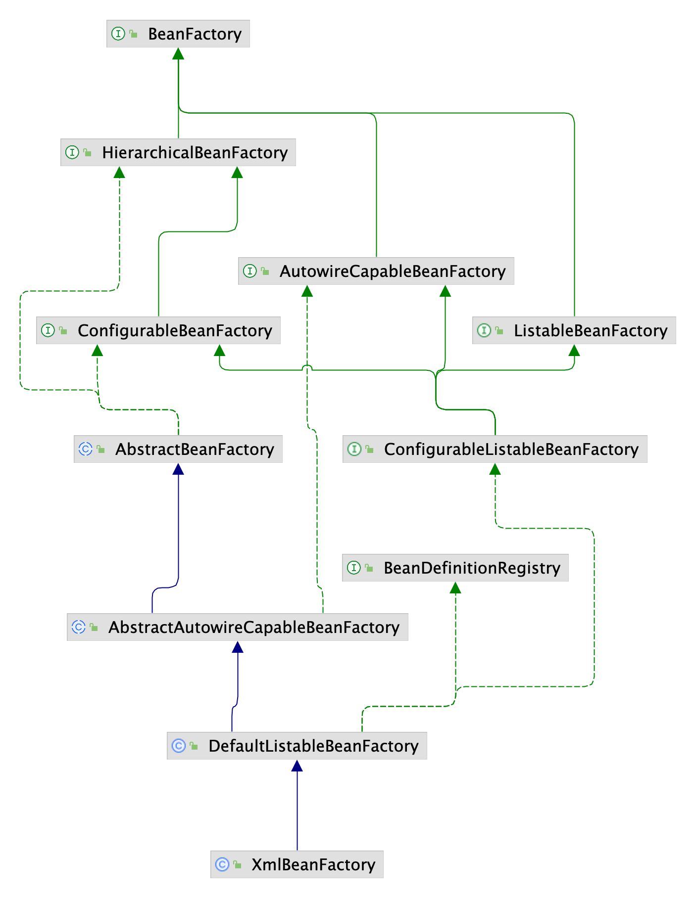

以下是 Spring 1.0 源码分析。

## Spring 核心组件

### Bean 组件

Bean 组件定义在 Spring 的 **org.springframework.beans** 包下，解决了以下几个问题：

这个包下的所有类主要解决了三件事：

- Bean 的定义
- Bean 的创建
- Bean 的解析

Spring Bean 的创建是典型的工厂模式，它的顶级接口是 BeanFactory。



#### BeanFactory

BeanFactory：Bean 的工厂类

```java
public interface BeanFactory {
	Object getBean(String name) throws BeansException;

	Object getBean(String name, Class requiredType) throws BeansException;

	boolean containsBean(String name);

	boolean isSingleton(String name) throws NoSuchBeanDefinitionException;

	String[] getAliases(String name) throws NoSuchBeanDefinitionException;
}
```

BeanFactory 提供方法：

- 通过名称获取 bean 实例，可以是独立实例或者单例实例

- 通过名称和指定类型获取 bean 实例，可以是独立实例或者单例实例
- 判断是否包含指定名称的实例
- 判断指定名称的实例是否是单例
- 获取指定名称的实例的别名


BeansException 继承自 NestedRuntimeException，NestedRuntimeException 提供了对 cause 的封装，JDK1.4的 RuntimeException 实现了这个。

BeansException的子类：

- FatalBeanException
  - ApplicationContextException
  - BeanCreationException
  - BeanDefinitionStoreException
    - FactoryBeanCircularReferenceException
    - UnsatisfiedDependencyException
  - BeanDefinitionValidationException
  - BeanInitializationException
  - BootstrapException
  - NullValueInNestedPathException

- BeanNotOfRequiredTypeException
  - BeanIsNotAFactoryException
- PropertyAccessException
  - MethodInvocationException
  - TypeMismatchException
- NoSuchBeanDefinitionException
- NotWritablePropertyException
- PropertyAccessExceptionsException

BeanFactory 有三个子类：ListableBeanFactory、HierarchicalBeanFactory 和 AutowireCapableBeanFactory。目的是为了**区分 Spring 内部对象处理和转化的数据限制**。


BeanFactory：接口

- HierarchicalBeanFactory：接口，可以继承的 BeanFactory
  - ConfigurableBeanFactory：接口，可以配置的 BeanFactory
    - ConfigurableListableBeanFactory：接口，SPI 接口，可配置和枚举的 BeanFactory
      - DefaultListableBeanFactory：类
        - XmlBeanFactory：类
    - AbstractBeanFactory：抽象类
      - AbstractAutowireCapableBeanFactory：抽象类
- AutowireCapableBeanFactory：接口，可以自动装配的 BeanFactory
- ListableBeanFactory：接口，可以枚举实例的 BeanFactory


但是从图中可以发现最终的默认实现类是 DefaultListableBeanFactory，它实现了所有的接口。


#### FactoryBean

FactoryBean：工厂 Bean，由 BeanFactory 中使用的对象实现的接口，这些对象本身就是工厂。如果一个bean实现了这个接口，它就被用作一个工厂，而不是直接作为一个bean。FactoryBean 可以支持单例和原型。

注意：实现此接口的 bean 不能用作普通 bean。

```java
public interface FactoryBean {
	Object getObject() throws Exception;

	Class getObjectType();

	boolean isSingleton();
}
```


FactoryBean实现类：

- PropertiesFactoryBean
- ResourceFactoryBean
- SetFactoryBean
- MapFactoryBean
- ListFactoryBean
- MethodInvokingFactoryBean

#### BeanDefinition

这里的 BeanDefinition 就是我们所说的 Spring 的 Bean，我们自己定义的各个 Bean 其实会转换成一个个 BeanDefinition 存在于 Spring 的 BeanFactory 中

```java
public class DefaultListableBeanFactory extends AbstractAutowireCapableBeanFactory
        implements ConfigurableListableBeanFactory, BeanDefinitionRegistry, Serializable {
		private Map beanDefinitionMap = new HashMap();
}   
```

BeanDefinition：描述 Bean 实例的接口

```java
public interface BeanDefinition {
	MutablePropertyValues getPropertyValues();

	ConstructorArgumentValues getConstructorArgumentValues();

	String getResourceDescription();
}
```

#### XxxPostProcessor

后置处理器是一种拓展机制，贯穿Spring Bean的生命周期

后置处理器分为两类：

- **BeanFactory后置处理器：BeanFactoryPostProcessor**，实现该接口，可以在**spring的bean创建之前**，修改bean的定义属性。

```java
public interface BeanFactoryPostProcessor {
    /*
     *  该接口只有一个方法postProcessBeanFactory，方法参数是ConfigurableListableBeanFactory，通过该参数，可以获取BeanDefinition
    */
    void postProcessBeanFactory(ConfigurableListableBeanFactory beanFactory) throws BeansException;
}
```

- **Bean后置处理器：BeanPostProcessor**，实现该接口，可以在spring容器实例化bean之后，在**执行bean的初始化方法前后**，添加一些处理逻辑。

```java
public interface BeanPostProcessor {
    //bean初始化方法调用前被调用
    Object postProcessBeforeInitialization(Object bean, String beanName) throws BeansException;
    //bean初始化方法调用后被调用
    Object postProcessAfterInitialization(Object bean, String beanName) throws BeansException;
}
```

**运行顺序**：

- Spring IOC容器实例化Bean
- 调用BeanPostProcessor的postProcessBeforeInitialization方法
- 调用bean实例的初始化方法
- 调用BeanPostProcessor的postProcessAfterInitialization方法

### Context 组件

Context 在 Spring 的 org.springframework.context 包下

Context 模块构建于 Core 和 Beans 模块基础之上，提供了一种类似于 JNDI 注册器的框架式的对象访问方法。Context 模块继承了 Beans 的特性，为 Spring 核心提供了大量扩展，添加了对国际化（例如资源绑定）、事件传播、资源加载和对 Context 的透明创建的支持。

ApplicationContext 是 Context 的顶级接口：


#### ApplicationContext

ApplicationContext ：接口

```java
public interface ApplicationContext
    extends ListableBeanFactory, HierarchicalBeanFactory, MessageSource, ResourceLoader {
	
	ApplicationContext getParent();
	
	String getDisplayName();

	long getStartupDate();

	void publishEvent(ApplicationEvent event);

}
```

- 提供 get 方法和发布事件的方法
- 继承 ListableBeanFactory, HierarchicalBeanFactory，可以获取 bean
- 继承 MessageSource，可以获取国际化
- 继承 ResourceLoader，可以加载资源文件

ApplicationContext 的子类主要包含两个方面：

1. ConfigurableApplicationContext：SPI 接口，表示该 Context 是可修改的，也就是在构建 Context 中用户可以动态添加或修改已有的配置信息

   ```java
   public interface ConfigurableApplicationContext extends ApplicationContext {
   	void setParent(ApplicationContext parent);
   
   	void refresh() throws BeansException;
   
   	ConfigurableListableBeanFactory getBeanFactory();
   
   	void close() throws ApplicationContextException;
   
   }
   ```

2. WebApplicationContext 顾名思义，就是为 web 准备的 Context 他可以直接访问到 ServletContext，通常情况下，这个接口使用少

   ```java
   public interface WebApplicationContext extends ApplicationContext, ThemeSource {
   	ServletContext getServletContext();
   }
   ```

再往下分就是按照构建 Context 的文件类型，接着就是访问 Context 的方式。这样一级一级构成了完整的 Context 等级层次。

总体来说 ApplicationContext 必须要完成以下几件事：

- 标识一个应用环境
- 利用 BeanFactory 创建 Bean 对象
- 保存对象关系表
- 能够捕获各种事件

## Spring IOC 流程


```java
public static void main(String[] args) {
        ApplicationContext applicationContext = new ClassPathXmlApplicationContext("classpath:applicationContext.xml");
        TestBean testBean = (TestBean) applicationContext.getBean("testBean");
        testBean.print();
    }
```

## Spring Bean 生命周期

## Spring AOP 原理

## Spring MVC 流程

## 总结

### 1. BeanFactory 和 ApplicationContext 区别

### 2. 创建 bean 有哪几种方式